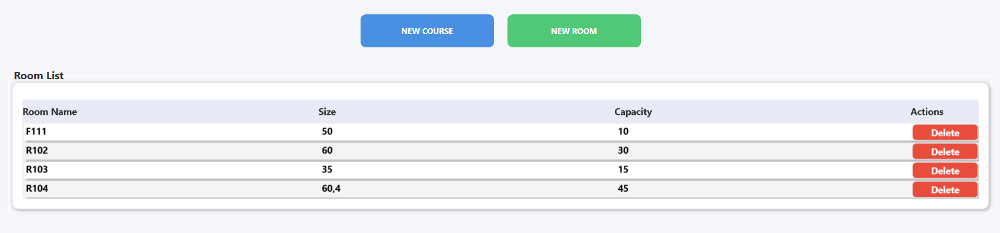
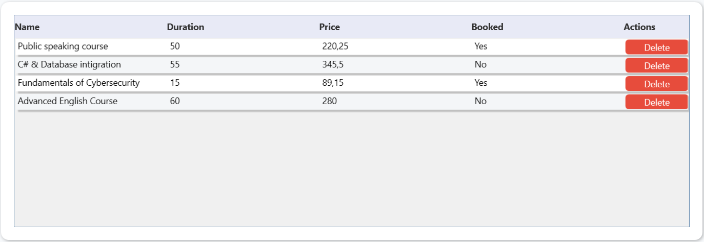
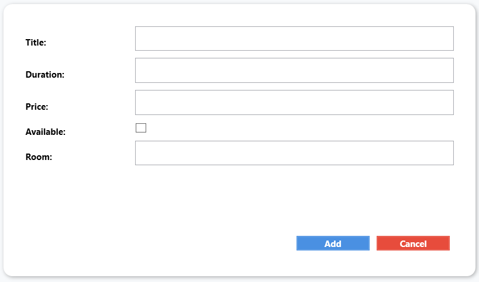
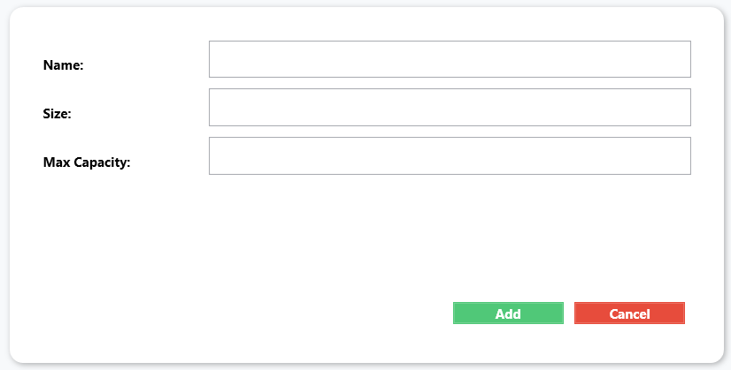

# KursVerwaltung

**KursVerwaltung** ist eine Desktop-Anwendung zur **Verwaltung von Räumen und Kursen**.  
Die Anwendung besteht aus einem **WPF-Frontend** für die Benutzeroberfläche und einem **Backend**, das über die `DbService`-Schicht auf eine **Oracle-Datenbank** zugreift.

---

## Frontend (WPF)

Dieses Frontend bietet eine grafische Oberfläche zur Anzeige, Erstellung und Löschung von Räumen und Kursen.

### Hauptfenster – MainWindow
- Anzeige aller Räume in einer **DataGrid-Tabelle**  
- Hinzufügen neuer Räume (**NewRoom-Dialog**)  
- Hinzufügen neuer Kurse (**NewCourse-Dialog**)  
- Öffnet bei Raumwahl die Kursübersicht (**CourseListWindow**)  
- Löschen von Räumen mit allen zugehörigen Kursen  



---

### Kursverwaltung – CourseListWindow
- Anzeige aller Kurse eines ausgewählten Raums  
- Einzelnes Löschen von Kursen  
- Anzeige von Kursdetails: **Name, Dauer, Preis, Buchungsstatus**  



---

### Neues Kursfenster – NewCourse
- Eingabemaske zum Anlegen eines neuen Kurses  
- Validierung von Pflichtfeldern: **Titel, Dauer, Preis, Raum**  
- Übergabe der Daten an den `DbService`  



---

### Neue Räume – NewRoom
- Eingabemaske zum Anlegen eines neuen Raums  
- Validierung von Pflichtfeldern: **Name, Größe, Kapazität**  
- Übergabe der Daten an den `DbService`  



---

### Technische Hinweise
- **Framework:** WPF (.NET Framework, C#)  
- **Datenbindung:** `ObservableCollection<T>` für automatische UI-Aktualisierung  
- **Interaktion:** Buttons, DataGrid, Dialogfenster  
- **Validierung:** Einfache Prüfungen über `MessageBox`

---

### Aufbau (Frontend-Dateien)

| Datei | Funktion |
|-------|---------|
| MainWindow.xaml(.cs) | Hauptoberfläche mit Raumübersicht und Navigationslogik |
| CourseListWindow.xaml(.cs) | Anzeige und Verwaltung der Kurse eines Raums |
| NewCourse.xaml(.cs) | Dialogfenster zum Erstellen eines neuen Kurses |
| NewRoom.xaml(.cs) | Dialogfenster zum Erstellen eines neuen Raums |

---

## Backend (Datenbankverbindung)

### Datenabfrage
- `GetAllRooms()` – liest alle Räume aus der Tabelle `B3_Pr_Room`  
- `GetCoursesByRoom(string rnr)` – gibt alle Kurse eines Raums zurück  

### Dateneinfügen
- `AddNewRoom(Row room)` – fügt einen neuen Raum hinzu  
- `AddNewCourse(Row course)` – fügt einen neuen Kurs hinzu  

### Löschen
- `DeleteRoomByPKeyAndItsCourses(string rnr)` – löscht Raum und alle zugehörigen Kurse  
- `DeleteCourseByPKey(string cnr)` – löscht einen Kurs nach ID  

---

### Datenstrukturen
- **Table** – enthält den Tabellennamen und eine Liste von `Row`-Objekten  
- **Row** – besteht aus einer Liste von `ITableField`-Feldern  
- **ITableField** – Schnittstelle für alle Feldtypen:
  - `Name`  
  - `Value`  
  - `ValueAsString`  
  - `TrySetValue(string input, out string error)`  

---

### Fehlerbehandlung
- SQL-Operationen in `try/catch`-Blöcken  
- Fehler werden als `ApplicationException` weitergegeben  
- Klare Ausnahmen bei fehlenden Datensätzen oder fehlerhaften Befehlen  

---

### Aufrufkette

```
Frontend (WPF)
   ↓
DbService
   ↓
KurslisteDB
   ↓
Oracle-Datenbank
